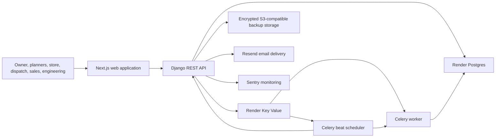
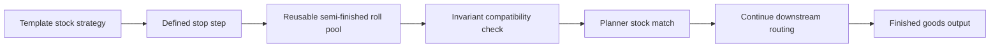
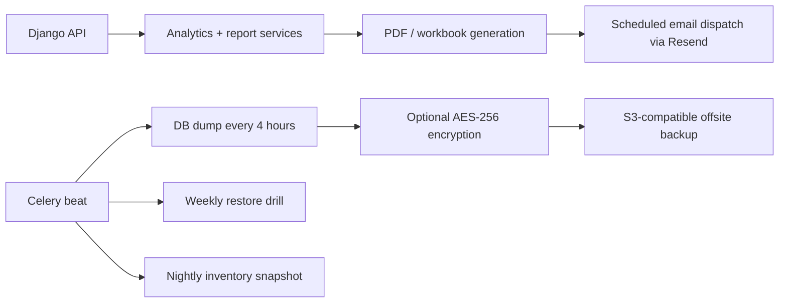

# Total Blueprint ERP

Total Blueprint ERP is a private, full-stack manufacturing ERP for flexible packaging plants. It combines planning, production execution, inventory control, sales, engineering, analytics, and governance in one system, with a web frontend, Django backend, managed PostgreSQL, Redis-backed job queues, and scheduled background services.

The system is designed for an owner-led manufacturing business that needs live plant visibility, controlled master data, traceable inventory movement, structured production routing, scheduled reporting, and secure cloud deployment from a private Git repository.

## What The System Covers

| Area | What users do here | Typical roles |
| --- | --- | --- |
| Operations | Plan work, assign jobs, monitor work centers, run machine terminals | Owner, admin, planner, work-center manager, operator |
| Inventory | Track rolls, bulk, packaging, GRNs, job work, inter-plant movement, genealogy | Store, planner, dispatch, owner |
| Logistics | Prepare packed loads, dispatch finished goods, manage challans | Dispatch, owner, admin |
| Sales | Manage customers, quotations, sales orders, and order-linked production | Sales, owner, admin |
| Analytics | Review KPIs, costing, MRP, stock health, capability coverage, and report packs | Owner, admin, plant manager, planner |
| Engineering | Maintain artwork, cylinders, routing rules, helper processes, and templates | Engineering, owner, admin |
| Administration | Manage users, role visibility, governance, and system health | Owner, super admin, admin |
| System Masters | Maintain plants, locations, work centers, machines, and commercial families | Owner, admin |

## Core Capability Snapshot

| Capability status | What it means in this ERP | Examples |
| --- | --- | --- |
| Supported today | Already modeled in the current product and available with the existing execution, inventory, and reporting logic | Finished roll stock, semi-finished roll reuse, standard pouch-family classification, business-friendly stock naming |
| Config only | Can be added through controlled masters, taxonomy, or report grouping without changing physical logic | New commercial family aliases, new stock grouping views, mainstream pouch naming variants |
| New logic required | Needs new code because the physical process, inventory object, or formula changes | New process states, new reconciliation formulas, new inventory object types |

## Linked Business Data Map

| Business object | Links to | Why it matters |
| --- | --- | --- |
| Plant | Work Center -> Machine | Defines where work happens and how reporting is grouped |
| Customer | Sales Order -> Sales Order Item | Connects commercial demand to production and dispatch |
| Template Blueprint | Routing Rule -> Process Steps | Defines what should be made and in which manufacturing sequence |
| Production Job | Work Center / Machine -> Execution Logs | Tracks live shop-floor execution and progress |
| Production Output | Inventory Roll / Finished Goods Batch | Converts execution into traceable stock |
| Packing Unit | Delivery Challan / Dispatch Pack | Bridges production completion into logistics and dispatch |
| Commercial Family / Materials | Explorer, planner, costing, and reports | Keeps stock names readable while preserving physical manufacturing rules |

## System Architecture

## Order To Dispatch Flow

```mermaid
flowchart LR
    Customer["Customer"] --> Quote["Quotation / commercial agreement"]
    Quote --> Order["Sales order"]
    Order --> Template["Template blueprint"]
    Template --> Routing["Routing + process sequence"]
    Routing --> Plan["Planned order / production job"]
    Plan --> Execute["Machine and work-center execution"]
    Execute --> Output["Finished batch / inventory roll"]
    Output --> Pack["Packing unit"]
    Pack --> Challan["Delivery challan"]
    Challan --> Dispatch["Dispatch bay / logistics"]
```

## Semi-Finished Reuse Flow

## Reporting And Backup Operations Flow

## Deployment Summary

| Topic | Current repo posture |
| --- | --- |
| Repository access | Private GitHub repository intended for the owner team only |
| Deployment source | Repo-root `render.yaml` Blueprint |
| Environments | Staging and production |
| Staging deploy policy | Auto-deploy after `backend-quality` and `frontend-quality` pass |
| Production deploy policy | Manual promotion from successful `main` commits |
| Runtime services | Backend API, frontend web, Celery worker, Celery beat, PostgreSQL, Redis |
| Backup model | Render PITR + app-level encrypted offsite backups |

## Operational Notes

- The backend exposes `/api/health/live/` and `/api/health/ready/` for service monitoring.
- Scheduled jobs handle backups, restore drills, queue monitoring, inventory snapshots, and report dispatch.
- Access is role-based across owner, admin, planner, operator, dispatch, store, sales, and engineering workflows.

## Client Deployment And Costing Guide

The detailed infrastructure, backup, pricing, governance, and deployment guide is here:

- [Client Deployment And Costing Guide](docs/client-deployment-and-costing.md)

For operator-focused deployment steps, use:

- [Render Deployment Guide](deploy/README.md)
