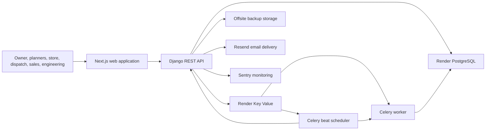
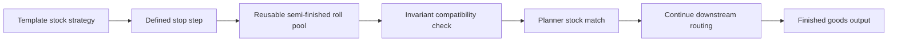
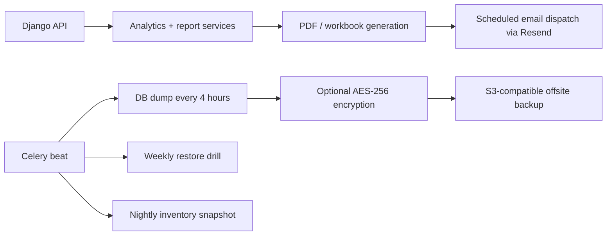

# Total Blueprint ERP

Private repository link for invited client viewing:

- [github.com/dev2495/total-blueprint-erp](https://github.com/dev2495/total-blueprint-erp)

Total Blueprint ERP is a private, full-stack manufacturing ERP for flexible packaging plants. It combines planning, production execution, inventory control, sales, engineering, analytics, and governance in one system with a Next.js frontend, Django backend, PostgreSQL database, Redis queue, and scheduled background automation.

The intended sharing model is simple:

- keep this GitHub repo private
- add the client as a GitHub collaborator
- send the repo root link above
- the client can read this README and browse files and folders, but the repo is not public

## What The System Covers

| Area | What users do here | Typical roles |
| --- | --- | --- |
| Operations | Plan work, assign jobs, monitor work centers, and run machine terminals | Owner, admin, planner, work-center manager, operator |
| Inventory | Track rolls, bulk, packaging, GRNs, job work, inter-plant movement, and genealogy | Store, planner, dispatch, owner |
| Logistics | Prepare packed loads, dispatch finished goods, and manage challans | Dispatch, owner, admin |
| Sales | Manage customers, quotations, sales orders, and order-linked production | Sales, owner, admin |
| Analytics | Review KPIs, costing, MRP, stock health, capability coverage, and report packs | Owner, admin, plant manager, planner |
| Engineering | Maintain artwork, cylinders, routing rules, helper processes, and templates | Engineering, owner, admin |
| Administration | Manage users, role visibility, governance, and system health | Owner, super admin, admin |
| System Masters | Maintain plants, locations, work centers, machines, and commercial families | Owner, admin |

## Sales Quotation Workspace

The sales module now includes a first-class quotation workspace for flexible packaging commercial teams.

- build multi-line quotations mixing pouch and roll products in one document
- use the existing geometry, physics, and BOM engine for live quantity and material breakdown
- add process-cost rows plus commercial overrides for margin, freight, packing, discount, and tax
- tag the customer and plant, save the quotation lifecycle, duplicate it, and generate a branded PDF
- convert a quotation into a sales order only after each line is mapped to a LIVE template

## Deployment Cost Options

All three options below use the same private GitHub repo. The difference is only how much managed Render infrastructure is kept live by default.

### Recommended Budget Summary

| Monthly cap | Deployment shape | Render core estimate | Recommendation |
| --- | --- | ---: | --- |
| `$100` | Production only, lean sizing | About `$60/month` | Works for a lighter live rollout with tighter concurrency headroom |
| `$150` | Production only, stronger sizing | About `$135/month` | Best fit for this project and the recommended default |
| `$200` | Recommended production plus always-on staging | About `$195/month` | First sensible tier for keeping staging live full time |

### `$100` Cap

Production only:

- backend `starter`
- frontend `starter`
- worker `starter`
- beat `starter`
- Postgres `basic-1gb` with `10 GB`
- Redis `starter`

This is the lean live option. It keeps the system online at the lowest sensible managed-cloud cost, but it gives less headroom for heavier concurrent usage, reporting spikes, and background queue bursts.

### `$150` Cap

Production only:

- backend `standard`
- frontend `starter`
- worker `standard`
- beat `starter`
- Postgres `pro-4gb` with `20 GB`
- Redis `starter`

This is the **recommended** option.

It keeps the monthly Render core around `$135/month`, which leaves a small working buffer for governance add-ons, backup storage growth, or operational overhead while still staying under the `$150/month` target.

### `$200` Cap

Recommended `$150` production stack, plus always-on staging:

- staging backend `starter`
- staging frontend `starter`
- staging worker `starter`
- staging beat `starter`
- staging Postgres `basic-1gb` with `10 GB`
- staging Redis `starter`

This brings the Render core to about `$195/month` and is the first tier where keeping a permanent staging environment makes sense.

### Important Budget Notes

- If the client wants direct Render dashboard access later, add the applicable Render seat cost on top of the selected option.
- If protected branches are required on a private personal GitHub repo, GitHub Pro is an optional governance add-on.
- If the long-term live budget is expected to stay materially above `$200/month`, it becomes reasonable to compare Render against an in-house server plus VPN access.

## Core Capability Snapshot

| Capability status | What it means in this ERP | Examples |
| --- | --- | --- |
| Supported today | Already modeled in the current product and available with the current execution, inventory, and reporting logic | Finished roll stock, semi-finished roll reuse, standard pouch-family classification, business-friendly stock naming |
| Config only | Can be added through controlled masters, taxonomy, or report grouping without changing physical logic | New commercial family aliases, new stock grouping views, mainstream pouch naming variants |
| New logic required | Needs new code because the physical process, inventory object, or formula changes | New process states, new reconciliation formulas, new inventory object types |

## Linked Business Data Map

| Business object | Links to | Why it matters |
| --- | --- | --- |
| Plant | Work Center -> Machine | Defines where work happens and how reporting is grouped |
| Customer | Sales Order -> Sales Order Item | Connects commercial demand to production and dispatch |
| Template Blueprint | Routing Rule -> Process Steps | Defines what should be made and in which manufacturing sequence |
| Production Job | Work Center / Machine -> Execution Logs | Tracks live shop-floor execution and progress |
| Production Output | Inventory Roll / Finished Goods Batch | Converts execution into traceable stock |
| Packing Unit | Delivery Challan / Dispatch Pack | Bridges production completion into logistics and dispatch |
| Commercial Family / Materials | Explorer, planner, costing, and reports | Keeps stock names readable while preserving physical manufacturing rules |

## System Architecture

## Order To Dispatch Flow

```mermaid
flowchart LR
    Customer["Customer"] --> Quote["Quotation / commercial agreement"]
    Quote --> Order["Sales order"]
    Order --> Template["Template blueprint"]
    Template --> Routing["Routing + process sequence"]
    Routing --> Plan["Planned order / production job"]
    Plan --> Execute["Machine and work-center execution"]
    Execute --> Output["Finished batch / inventory roll"]
    Output --> Pack["Packing unit"]
    Pack --> Challan["Delivery challan"]
    Challan --> Dispatch["Dispatch bay / logistics"]
```

## Semi-Finished Reuse Flow

## Reporting And Backup Operations Flow

## Default Deployment Summary

| Topic | Current default repo posture |
| --- | --- |
| Repository access | Private GitHub repository for invited collaborators only |
| Shareable view link | Repo root URL on GitHub after collaborator invite |
| Deployment source | Repo-root `render.yaml` Blueprint |
| Default environment | Production only |
| Default deploy policy | Controlled production deploy from successful `main` commits after review |
| Runtime services | Backend API, frontend web, Celery worker, Celery beat, PostgreSQL, Redis |
| Backup model | Render PITR plus app-level encrypted offsite backups |

## Operational Notes

- The backend exposes `/api/health/live/` and `/api/health/ready/` for monitoring.
- Scheduled jobs handle backups, restore drills, queue monitoring, inventory snapshots, and report dispatch.
- Access is role-based across owner, admin, planner, operator, dispatch, store, sales, and engineering workflows.

## More Detail

For the full deployment math and option-by-option breakdown:

- [Client Deployment And Costing Guide](docs/client-deployment-and-costing.md)

For operator-focused deployment steps:

- [Render Deployment Guide](deploy/README.md)
