# Current Local System Walkthrough & Video Script - 2026-05-11

This guide documents the current local worktree system, not the older committed Render version. Use it as the Scribe/video recording path and as the operator handoff index for the new Product Master, Sales, Inventory V36, stock lifecycle, packing, and planner flows.

## Source Of Truth

- Local app: `http://127.0.0.1:3001`
- LAN app: use the `start_all.sh verify` output IP after restart.
- Generated help docs: `docs/user-guides/`
- Screenshot assets: `frontend_v2/public/help/screenshots/`
- Help content source: `frontend_v2/src/help/content/pages/pages.json`
- Inline help shell: `/help` and the page-level Help button.

## 1. Login And Orientation

1. Open the local or LAN URL and log in as an admin/test operator.
2. Confirm the sidebar shows the current workspaces, not the legacy inventory and SKU pages.
3. Open `/help` and confirm the full help center loads with Overview, Steps, Decision Flow, FAQ, and Related routes.

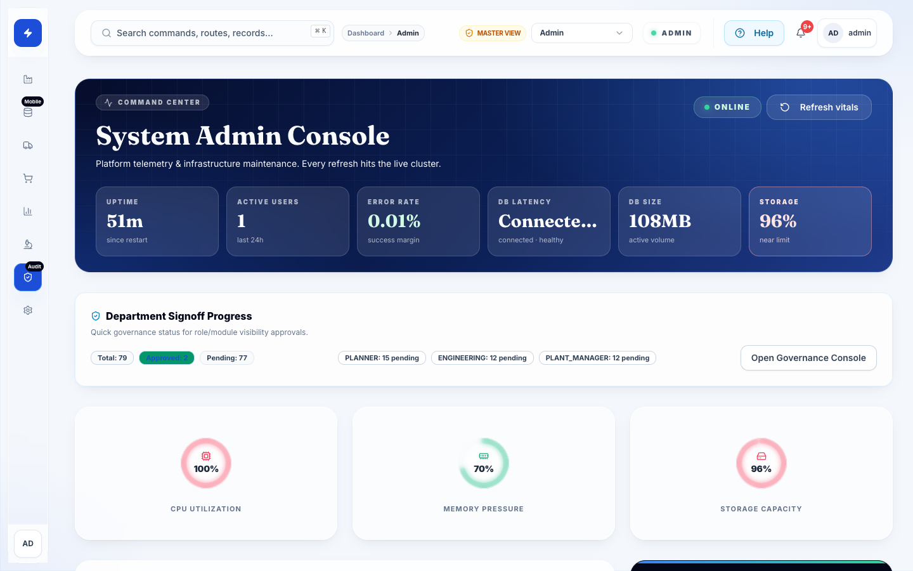

## 2. Product Master Setup

1. Open `/master/products`.
2. Create or review a pouch Product Master.
3. Confirm final product size is present in the product naming; roll width remains a production/input attribute, not a sales-facing product name.
4. Confirm geometry fields follow the real pouch model: `W`, `H`, `adjustments`, `faces`, `trim loss`, and `flap`.
5. Assign and save the live route/template, then reopen the Product Master and confirm the assignment still shows.

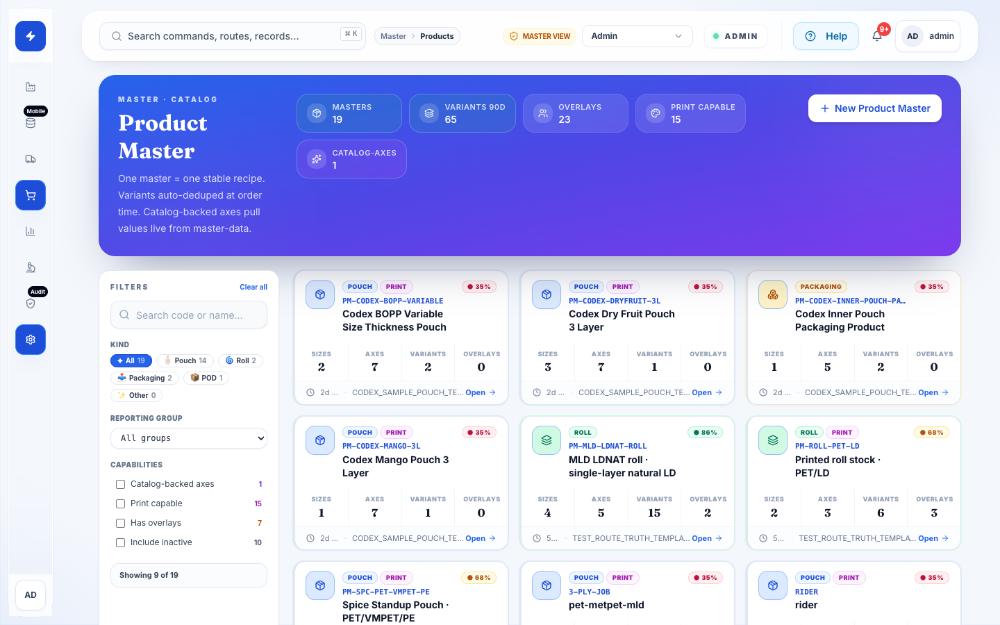

## 3. Sales Order Create

1. Open `/sales/orders/create`.
2. Select the Product Master first.
3. Pick customer/artwork/axis values only when the product requires them.
4. Use BOM preview and blockers before saving.
5. Confirm the saved sales order number is year-scoped and readable for operations.

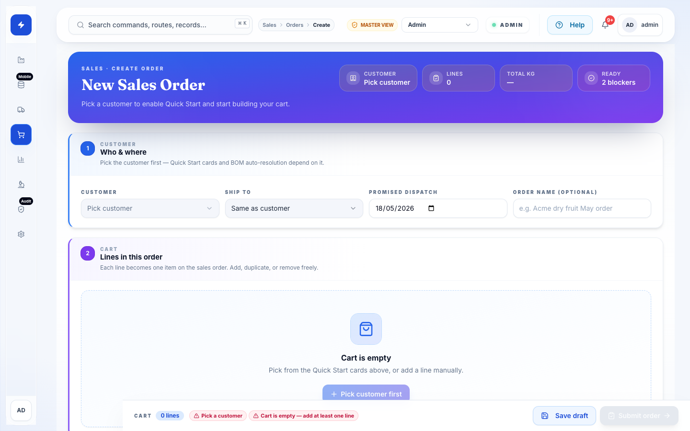

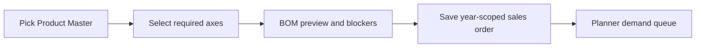

## 4. Planner And Stock Launcher

1. Open `/production/planner`.
2. Review demand, stock pool, queue, releases, and current WIP.
3. For stock creation, open `/production/planner/stock-launcher`.
4. Select Generic WIP/Roll, Customer, Artwork, Customer + Artwork, Packaging, or POD mode based on commitment.
5. Confirm invariant signature, required material preview, matching demand, and BOM-by-route-step populate after master and axes are selected.

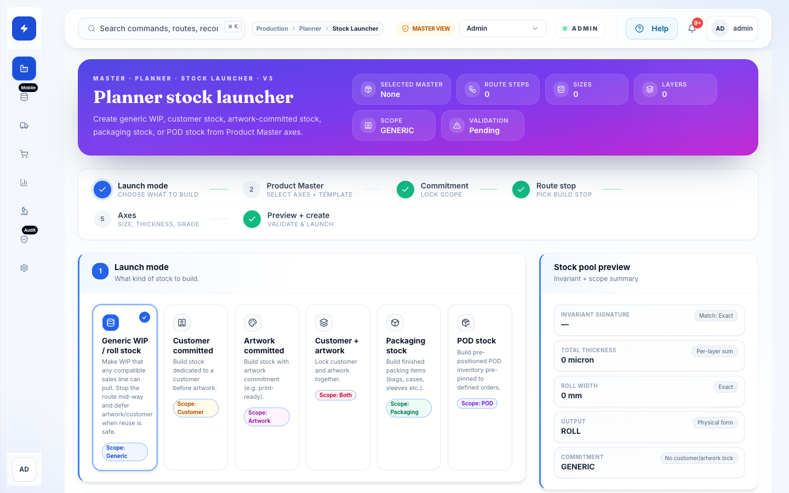

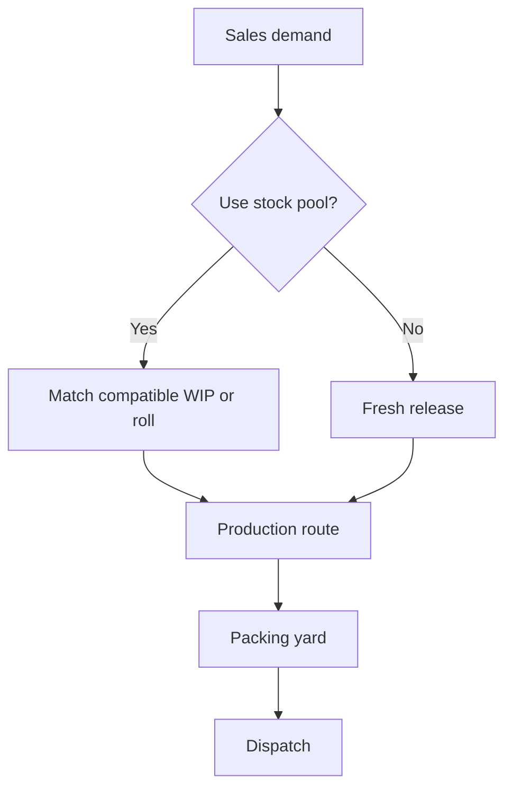

## 5. Smart GRN

1. Open `/inventory/grn-v36`.
2. Use the material-type chips at the top to filter the material picker.
3. For bulk granules, select by material code and grade where applicable.
4. For rolls, enter gross and tare; net is computed by the system.
5. For purchased add-ons, select the active purchased add-on material and use its purchase UOM.
6. Keep QC/documents collapsed unless COA, lab values, or inspector notes are needed.

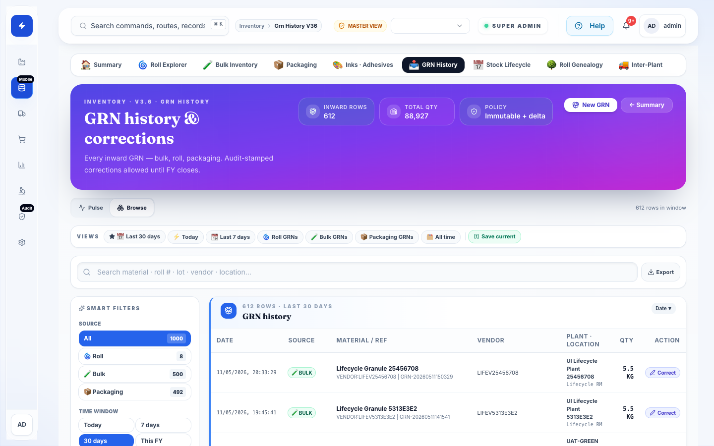

## 6. Inventory Workspaces

Use `/inventory` as the summary launcher. Dedicated workspaces stay inside the inventory domain:

- Rolls: `/inventory/rolls-v36`
- Bulk & chemicals: `/inventory/bulk-v36`
- Packaging: `/inventory/packaging-v36`
- Add-ons: `/inventory/addons-v36`
- GRN history: `/inventory/grn-history-v36`
- Traceability: `/inventory/traceability-v36`
- Inter-plant: `/inventory/inter-plant-v36`

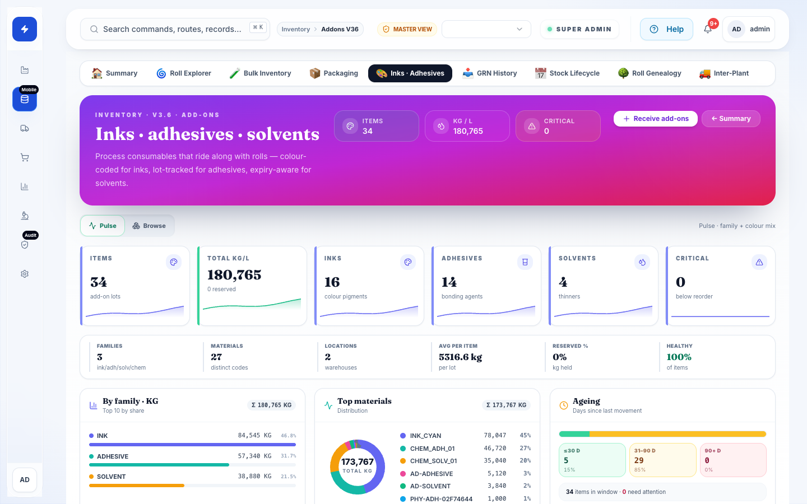

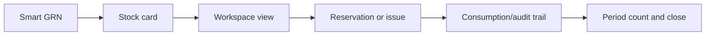

## 7. Stock Lifecycle

1. Open `/inventory/period`.
2. Use opening balance for go-live stock.
3. Create a full or scoped count batch.
4. Load stock rows into the batch, enter counted quantity, validate, submit, approve, and post.
5. Use close preview, begin close, and close when blockers are clear.
6. For closed-year correction, enter the correction row, quantity, and reason, then post through the controlled correction panel.

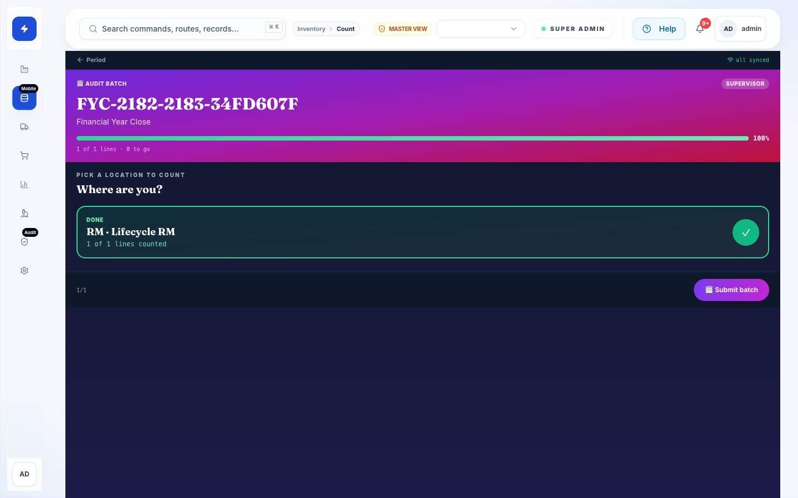

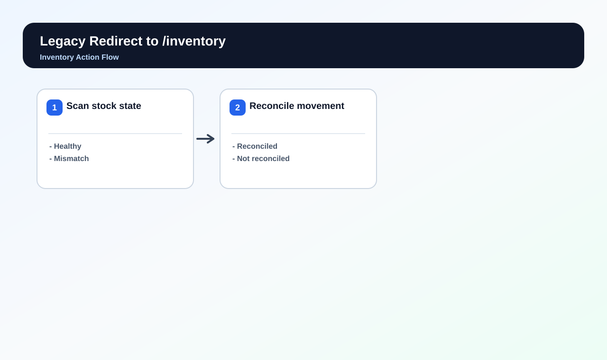

## 8. Packing Yard And Daily Packing Material Count

1. Open `/logistics/packing`.
2. Pack eligible orders and record operational packing actions.
3. Inner pouch consumption is computed from order math.
4. Gunny count is captured from sealed gunny bags.
5. Sheets, tapes, labels, and other allowed packing materials are controlled by master configuration and daily/evening snapshot count.
6. Open `/logistics/packing/consumption` for packing-material snapshot/count review.

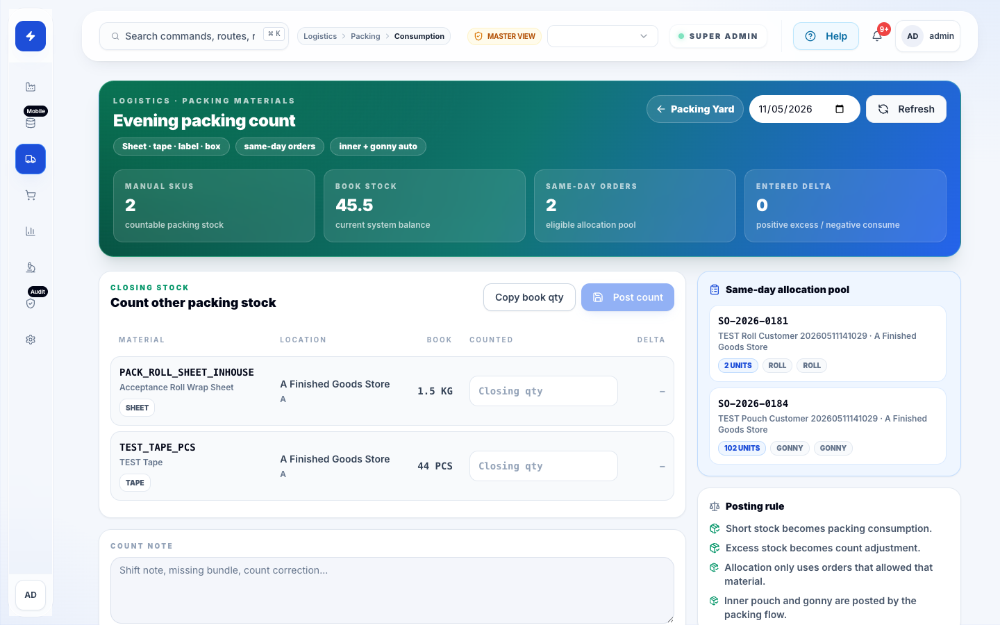

## 9. Dispatch And Traceability

1. From Packing Yard, move completed packed goods into dispatch-ready state.
2. Use tracking and traceability pages to inspect stock card, roll lineage, order status, and movement history.
3. If a mismatch is found, use Period & Audit correction instead of editing stock directly.

## 10. Scribe / Video Recording Order

Use this exact recording order for a clean walkthrough:

1. Login and show current sidebar.
2. Open Help Center and show searchable guide plus decision flow.
3. Product Master list/detail/create.
4. Sales order create and BOM/blocker preview.
5. Planner and Stock Launcher.
6. Smart GRN with material chips and roll gross/tare/net.
7. Inventory summary and each V36 workspace.
8. Period & Audit stock lifecycle: opening, count, post, close, correction.
9. Packing Yard and packing-material consumption snapshot.
10. Traceability and dispatch handoff.

## Operator Rule

When a page errors, do not silently continue. The current app shows a global data/action error toast with status, route, operation, and retry where possible. Capture that toast, route, timestamp, and selected filters in the support note.
