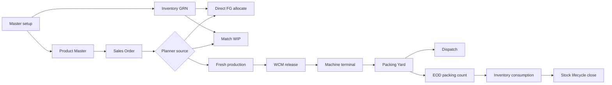

# Final ERP E2E Training And Green Report - 2026-05-14

Worktree: `/Users/devarshthakkar/local_repos/erp total/.claude/worktrees/optimistic-borg-130fe2`

Local frontend: `http://127.0.0.1:3001/login`

LAN frontend: `http://192.168.0.229:3001/login`

Backend health: `http://127.0.0.1:8000/api/health/`

## Green Status

The current local Product Master system is green under the automated backend and browser gates available in this worktree.

| Area | Command / Gate | Result |
| --- | --- | --- |
| Django project health | `python manage.py check` | OK |
| Backend domain regression | `manage.py test apps.materials apps.sales apps.inventory apps.production apps.artwork apps.tooling apps.physics apps.templates apps.factory --keepdb` | 377 tests OK |
| Frontend TypeScript | `npm run typecheck` | OK |
| Mutation E2E | `npx playwright test tests/e2e/mutations --reporter=list` | 13 passed |
| Full UI gate | `npx playwright test tests/e2e/gate --reporter=list` | 233 passed |

The final full UI gate covered login/logout, role navigation, inventory V36 workspaces, GRN, packaging proof, sales create, Product Master lanes, planner artwork gate, WCM, operator machine terminal, dispatch/logistics, responsive desktop/tablet/mobile shells, static route coverage, stock lifecycle, roll variant stock, capability matrix, and WIP route proof.

## System Model

The system has moved from SKU-variant-first to Product-Master-first.

The Product Master is the stable engineering contract. It stores the route template, layer identity, output kind, size geometry rules, required/optional axes, print capability, allowed artwork behavior, packaging/POD/add-on options, and customer overlay defaults.

The Sales Order line is the actual configured variant. A line selects a Product Master and then fills the required axes for that order: size, thickness, grade where applicable, roll width override when needed, artwork, POD, packing choice, add-ons, customer overlay, and quantity.

The generated tuple becomes the SKU-like execution identity for planning, WIP matching, BOM preview, WCM, packing, dispatch, and traceability. This gives the old SKU variant system's BOM certainty without forcing every possible combination to exist as a pre-created SKU.

## Product Master Rules

- Route template is mandatory before the master can be live.
- Layer count and film/material identity are fixed on the master.
- Thickness is not globally fixed unless the user chooses to make it fixed. It can be an axis and can be any positive micron value.
- Grade is selected from the grade master only where the film is extrudable and grade-dependent.
- Purchased films do not ask for grade unless the material policy explicitly supports grade.
- Final product name and tuple labels include the final size, not the roll width.
- Roll width is a consumption/planning value, either entered directly or calculated from geometry.
- Product Master size geometry uses the same business concepts as the old variant model: final W, final H, faces, gusset, gusset affects W/H, trim loss, trim affects W/H, flap/tape, roll form, roll width override, and custom W/H adjustments.

## Axis Meaning

| Axis mode | Meaning |
| --- | --- |
| Off | The field is not part of this product's order flow or BOM identity. |
| Optional | Sales/planner may enter it. If entered, it becomes part of matching and BOM. If skipped, it is not required. |
| Required | Sales/planner must enter it before the line can be planned or released. |

Variant tuples are created from actual choices. One Product Master can safely have 15-20 active tuples because tuples are only created when real demand or planner stock needs them.

## Geometry Model

The Product Master does not need hard-coded pouch templates for every shape. The generic geometry model is enough:

1. Start with final product width and height.
2. Apply faces.
3. Apply gusset to width, height, or both as configured.
4. Apply trim loss to width, height, or both.
5. Apply flap/tape where needed.
6. Apply any custom adjustment rows for exact customer/tooling allowances.
7. Calculate auto roll width unless a roll width override is entered.

For a roll output, only roll-relevant fields are needed: final width, faces where relevant, trim loss, roll form, and roll width override. Height is not required for roll stock unless the route/output specifically needs cut length.

The live preview must show:

- final effective W/H,
- auto roll width,
- total thickness,
- layer stack,
- required material breakdown,
- route stop/step BOM preview.

## Artwork And Printing

Printing is split into two decisions:

- Print capable: this product can go through print-related steps.
- Artwork required: this order cannot release through print until an approved artwork is selected.

If print capable is on and artwork required is off, the flow supports warning printing, standard text printing, or other print/tape cases where a formal artwork asset is not required. Any material consumption for warning tape, ink, labels, or similar items should come from add-ons, packing rules, or route BOM policy.

If artwork required is on, sales or planner must choose an approved artwork before print release.

Artwork is a colorway and production print asset. It can be global or customer-specific and carries:

- print process such as ROTO, FLEXO, or DIGITAL,
- web form such as sheet or tubing,
- front/back color counts such as 2F, 3F, 3F3B,
- actual color labels,
- inventory ink mapping,
- cylinder readiness where ROTO requires cylinders,
- customer/product applicability.

Ink consumption must come from mapped inventory ink masters, not free text colors. Color names are only user-facing labels.

## Customer Overlay

Customer overlay is not a separate SKU. It is a customer-specific default and restriction layer over the Product Master.

Useful overlay fields:

- customer item code,
- customer display name,
- MOQ,
- price basis,
- default size lock,
- default artwork,
- default packing choices,
- default POD choice,
- customer-specific allowed packing SKUs,
- customer-specific layer grade preset,
- active/inactive.

When sales starts an order for that customer, these defaults prefill the line. The user can still change fields when the Product Master axis allows it.

## Packing And POD Model

Packaging and POD are catalog-backed axes. This means the order chooses real master-data rows, not free text.

Product Master can allow multiple inner pouch, POD, sheet, tape, label, carton, and other packing SKUs. A sales order line chooses the exact option when that option is part of the order identity.

Rules:

- Inner pouch: one selected inner pouch SKU per order line; consumption is automatic by `ceil(total_pouches / pcs_per_inner)`.
- Gunny: counted in Packing Yard when sealed; each sealed gunny consumes one gunny or the configured unit count.
- Other packing materials: allow-listed on Product Master or customer overlay; consumption is captured through EOD packing count open-close logic and mapped back to eligible same-day orders.
- POD: one selected POD per order line when POD is enabled; stock can be in-house or purchased.
- In-house packaging and POD replenishment is handled through its own Product Master and stock launcher demand.
- Purchased packaging, POD, and purchased add-ons are inwarded through Smart GRN.

## Generic WIP And Planner Stock

Generic WIP is not a separate Product Master. It is stock created from the same Product Master without customer/artwork commitment.

Generic WIP matching uses an invariant signature. The invariant includes the route/template, output form, layer identity, size/geometry, required thickness/grade/roll width values, and any required catalog axes. It excludes customer and artwork until those are deliberately locked.

Stock launcher must know enough axis values to compute BOM and consumption. For example, a dry fruit pouch roll cannot be launched generically with no size, thickness, or roll width because consumption math is impossible. If roll width is not entered, the system computes it from final geometry and trim rules.

Planner release paths:

- Direct FG: finished goods or packed/dispatchable stock already exists and can be allocated.
- Match WIP: compatible WIP exists at the right invariant or later route step and can be committed to the sales order.
- Fresh: no suitable stock exists, so the planner releases a new production job from the Product Master tuple.

## End-To-End Operating Flow

## Role Guide

### Admin / Owner

Use admin for master setup, role validation, route setup, period controls, and final close review.

Primary surfaces:

- `/dashboard/admin`
- `/system/role-matrix`
- `/system/governance`
- `/inventory/period`
- `/master/products`

### Store / Inventory

Use Store for GRN, stock visibility, opening balances, counts, inter-plant receiving, and traceability.

Primary surfaces:

- `/inventory`
- `/inventory/grn-v36`
- `/inventory/rolls-v36`
- `/inventory/bulk-v36`
- `/inventory/packaging-v36`
- `/inventory/addons-v36`
- `/inventory/count`
- `/inventory/inter-plant-v36`
- `/inventory/traceability-v36`

Smart GRN supports rolls, bulk, packaging, POD, and purchased add-ons. Roll inward captures gross, tare, and net. Net is computed from gross minus tare where applicable.

### Sales

Use Sales for fast order entry, repeat order creation, customer overlays, artwork choice, packing/POD choice, add-ons, and custom orders.

Primary surfaces:

- `/sales/orders/create`
- `/sales/orders/new`
- `/sales/orders`
- `/sales/customers`

Sales should choose Product Master first, then customer, then size and required axes. Live preview should show product geometry, material requirements, artwork readiness, packing/POD choices, and blockers before submitting.

Submitted eligible orders go to planner, not draft.

### Planner

Use Planner for source decision, stock launcher, artwork gate resolution, and release.

Primary surfaces:

- `/production/planner`
- `/production/planner/stock-launcher`
- `/dashboard/planner/control-tower/command`
- `/dashboard/planner/control-tower/plan-queue`
- `/dashboard/planner/control-tower/live-production`
- `/dashboard/planner/control-tower/stock-intelligence`

Planner chooses Direct FG, Match WIP, or Fresh. For planner stock, choose the Product Master and required invariant axes before launch so BOM math is known.

### Work Center Manager

Use WCM to assign machines, validate current-step material rules, allocate lineage/fallback rolls, and release jobs to operators.

Primary surfaces:

- `/production/work-center`
- `/production/work-center/[id]`

The WCM screen shows selected sales product, machine assignment, material release, current-step issue, lineage rolls, fallback rolls, and route-step status.

### Operator

Use Operator for machine execution.

Primary surfaces:

- `/production/machine-selector`
- `/production/machine/[machine_id]`

Operator sees released jobs only. They start/resume jobs, log output, and follow machine-specific execution prompts.

### Packing Yard

Use Packing Yard for roll packing, pouch/gunny sealing, dispatch handoff, and daily packing material counts.

Primary surfaces:

- `/logistics/packing`
- `/logistics/packing/consumption`

Packing Yard should not manually enter per-order tape/sheet/tag consumption. It should pack rolls/pouches, count gunnies as sealed, and enter EOD stock count for packing materials. The system maps allowed materials back to eligible orders.

### Dispatch

Use Dispatch for challan creation and shipment proof.

Primary surfaces:

- `/logistics/dispatch`
- `/logistics/transit`

Dispatch works from the packing queue and dispatch-ready units.

## Inventory Lifecycle

The stock lifecycle uses the V36 period/audit model:

1. Open or select active period.
2. Enter opening balances for go-live or new stock classes.
3. Receive stock through Smart GRN or inter-plant receiving.
4. Consume stock through production, WCM, packing yard, dispatch, and EOD packing count.
5. Create full or quick stock count batches.
6. Save counted quantities.
7. Validate variance.
8. Approve/post adjustments.
9. Close period when blockers are resolved.
10. Use FY correction only for approved closed-year corrections.

The default variance design is symmetric 2% flagging. Year-end close should require owner signoff.

## Inter-Plant Flow

Inter-plant movement has two sides:

- sending plant creates and dispatches the transfer,
- receiving plant receives into the destination location and updates stock.

The receiving flow should use the exact transfer reference so genealogy and stock movement stay linked.

## What To Check When A User Gets Stuck

| Problem | First checks |
| --- | --- |
| Sales line cannot submit | Missing size, missing required axis, unit price missing, required artwork not selected, no route template on Product Master. |
| BOM preview empty | Product Master missing live route/template, size geometry missing, no thickness where required, recipe range does not match selected film/grade/thickness. |
| Generic WIP cannot launch | Missing invariant axis values: size, thickness, grade, roll width, or required catalog axis. |
| WIP did not match | Invariant signature differs: route, layer stack, size, thickness, grade, width, POD, or required axis mismatch. |
| Artwork blocked | Artwork not approved, ink mapping missing, ROTO cylinders not finalized, artwork not allowed for selected product/customer. |
| Ink consumption wrong | Check artwork ink mapping to inventory ink masters; color label alone is not enough. |
| Packing option missing in sales | Product Master or customer overlay does not allow that packing SKU/category. |
| Inner pouch consumption wrong | Check selected inner pouch SKU and `pcs_per_inner`; system consumes `ceil(total_pouches / pcs_per_inner)`. |
| Gunny consumption wrong | Check Packing Yard sealed gunny count. |
| Tape/sheet/tag consumption missing | Check EOD packing count and allowed SKU list for same-day packed orders. |
| Roll GRN net wrong | Check gross, tare, and net calculation on Smart GRN line. |
| Period close blocked | Check negative stock, draft counts, unposted variances, open jobwork/inter-plant blockers. |
| Dispatch not showing units | Check Packing Yard release state and sales order dispatch readiness. |

## Training Bot Knowledge Pack

A support bot trained on this report should answer from these principles:

- Product Master is not the SKU. The actual order tuple is created from selected axes.
- Do not ask users to create a new master for every size/thickness/artwork combination.
- Ask for the Product Master, route/template, customer, final size, layer thicknesses, grade only where extrudable, artwork if required, POD if enabled, packing selection, and quantity.
- For generic WIP, ask for all invariant values needed for consumption math.
- For artwork, distinguish print capable from artwork required.
- For packaging, distinguish inner pouch auto math, gunny sealed count, and other packing EOD count.
- For stock issues, trace the movement chain: GRN/opening -> production/WCM -> packing -> dispatch -> period close.
- For BOM issues, trace the engineering chain: Product Master -> size geometry -> layer recipe -> route template -> artwork/packing/POD/add-on axes -> BOM preview.

## Current Compatibility Note

The primary UI is the V36/Product Master surface. Some legacy routes still exist as redirects or static route safety checks because browser gates intentionally verify they do not crash. They should not be treated as the operating model for new staff training.

## Evidence Summary

The latest successful full UI gate finished with:

`233 passed (11.6m)`

The latest successful mutation E2E gate finished with:

`13 passed (2.3m)`

The latest backend regression finished with:

`Ran 377 tests ... OK`

No commit was made in this pass.
