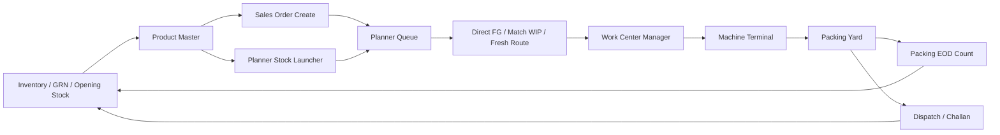

# Full Flow Walkthrough And Verification - 2026-05-13

Working tree: `/Users/devarshthakkar/local_repos/erp total/.claude/worktrees/optimistic-borg-130fe2`

Local app:
- Frontend: `http://127.0.0.1:3001`
- Backend: `http://127.0.0.1:8000`
- LAN frontend for client testing: `http://192.168.0.229:3001`
- LAN backend health: `http://192.168.0.229:8000/api/health/`

## Result

The current local system is green for the verified product-master sales model, inventory V36, stock lifecycle, planner release gates, WIP/direct-FG source logic, WCM allocation, machine terminal route, packing yard, EOD packing count, and dispatch surfaces.

Scribe was attempted in Chrome, but the active Scribe capture was a stale mixed capture from unrelated browser activity. That cloud Scribe is not used as a staff training artifact and no share link was copied into this report. The correct walkthrough is the local generated HTML/video/screenshot pack below.

## Walkthrough Artifact

- HTML guide: `/Users/devarshthakkar/local_repos/erp total/.claude/worktrees/optimistic-borg-130fe2/.runtime/walkthroughs/full-flow-20260513150306/index.html`
- Video: `/Users/devarshthakkar/local_repos/erp total/.claude/worktrees/optimistic-borg-130fe2/.runtime/walkthroughs/full-flow-20260513150306/video/aee65ab3def3dd7177a936d78ea5056a.webm`
- Screenshots: `/Users/devarshthakkar/local_repos/erp total/.claude/worktrees/optimistic-borg-130fe2/.runtime/walkthroughs/full-flow-20260513150306/screenshots/`
- Manifest: `/Users/devarshthakkar/local_repos/erp total/.claude/worktrees/optimistic-borg-130fe2/.runtime/walkthroughs/full-flow-20260513150306/manifest.json`

The walkthrough includes 18 steps:

1. Admin and role shell
2. Inventory Workspace
3. Smart GRN
4. Rolls Matrix
5. Bulk and ink stock
6. Packaging stock
7. Stock lifecycle
8. Packing EOD count
9. Product Master list
10. Artwork and colorways
11. Sales order create
12. Planner command
13. Planner queue
14. Stock launcher
15. Work Center Manager
16. Machine terminal
17. Packing yard
18. Dispatch

## Flow Model Verified



## Fixes Added In This Pass

- Added backend regression coverage for two all-extruded printed Product Masters with artwork/colorway, ink inventory mapping, customer overlay/default artwork, packing inner/outer axes, POD, add-on, in-house packaging/POD demand, and sales confirmation to planner.
- Updated planner queue browser gates to use the current queue rows and artwork picker instead of stale selectors.
- Updated WCM/WIP browser proof for current job labels, current roll allocation wording, and state-safe reruns.
- Added stable WCM unassign button test IDs on the visible current-step allocation list.
- Added `frontend_v2/scripts/capture_full_flow_walkthrough.mjs` to regenerate the local training walkthrough video and screenshot guide.
- Cleaned generated help SVG trailing whitespace so `git diff --check` is green.
- Clarified Product Master printing contract: Product Master stores fallback print method/web form only; selected artwork/colorway carries actual method, sheet/tubing, colors, ink mapping, and cylinder gate.
- Removed manual per-order packing quantity entry from Product Master packing contract. Inner pouch stores only `pcs per inner`, gunny is counted in Packing Yard, and all other allowed packing SKUs use EOD open-close allocation.
- Added live EOD packing allocation metrics to the inventory packaging workspace: consumed today, mapped orders, unassigned count short, and top materials.
- Added backend `eod_allocation` metrics on the packing material count snapshot and regression coverage for the consumption metric.

## Verification Gates

Backend product/artwork/packing regression:

```bash
'/Users/devarshthakkar/local_repos/erp total/venv/bin/python' manage.py test \
  apps.sales.tests.test_all_extruded_artwork_flow \
  apps.sales.tests.test_photo_product_master_flow \
  apps.sales.tests.test_artwork_product_validation \
  apps.materials.tests_product_master \
  apps.production.tests.test_in_house_demand_service \
  apps.production.tests.test_packing_count_service \
  --keepdb --verbosity=2
```

Result: `Ran 44 tests ... OK`.

Deep local server verification:

```bash
env BACKEND_PYTHON='/Users/devarshthakkar/local_repos/erp total/venv/bin/python' ./start_all.sh verify
```

Result: deep route/auth/API/static verification passed.

Frontend typecheck:

```bash
npm run typecheck
```

Result: passed.

Focused browser gates:

```bash
env UI_E2E_SKIP_BOOTSTRAP=1 UI_BASE_URL='http://127.0.0.1:3001' \
  BACKEND_PYTHON='/Users/devarshthakkar/local_repos/erp total/venv/bin/python' \
  PLAYWRIGHT_BROWSER_CHANNEL=chrome PLAYWRIGHT_DISABLE_VIDEO=1 \
  npx playwright test --project=gate \
  tests/e2e/gate/sales-fast-entry.spec.ts \
  tests/e2e/gate/inventory-workspace.spec.ts \
  tests/e2e/gate/stock-lifecycle.spec.ts \
  tests/e2e/gate/packaging-proof.spec.ts \
  tests/e2e/gate/planner-artwork-gate.spec.ts \
  tests/e2e/gate/planner-truth.spec.ts \
  tests/e2e/gate/shop-floor-ux.spec.ts \
  tests/e2e/gate/wip-route-proof.spec.ts
```

Result: `10 passed`.

Focused inventory/packing gate after the EOD metric patch:

```bash
env UI_E2E_SKIP_BOOTSTRAP=1 UI_BASE_URL='http://127.0.0.1:3001' \
  UI_E2E_USERNAME=admin UI_E2E_PASSWORD=admin123 \
  BACKEND_PYTHON='/Users/devarshthakkar/local_repos/erp total/venv/bin/python' \
  PLAYWRIGHT_BROWSER_CHANNEL=chrome PLAYWRIGHT_DISABLE_VIDEO=1 \
  npx playwright test --project=gate \
  tests/e2e/gate/inventory-workspace.spec.ts \
  tests/e2e/gate/packaging-proof.spec.ts
```

Result: `3 passed`.

Focused backend EOD metric test:

```bash
'/Users/devarshthakkar/local_repos/erp total/venv/bin/python' manage.py test \
  apps.production.tests.test_packing_count_service --keepdb --verbosity=2
```

Result: `3 passed`.

Django system check:

```bash
'/Users/devarshthakkar/local_repos/erp total/venv/bin/python' manage.py check
```

Result: `System check identified no issues`.

Whitespace check:

```bash
git diff --check
```

Result: passed.

## Acceptance Evidence

Generated acceptance files:

- `/Users/devarshthakkar/local_repos/erp total/.claude/worktrees/optimistic-borg-130fe2/.runtime/ui-e2e/acceptance/e2e_report.md`
- `/Users/devarshthakkar/local_repos/erp total/.claude/worktrees/optimistic-borg-130fe2/.runtime/ui-e2e/acceptance/wip_route_truth.md`
- `/Users/devarshthakkar/local_repos/erp total/.claude/worktrees/optimistic-borg-130fe2/.runtime/ui-e2e/acceptance/inhouse_packaging_proof.md`
- Roll challan: `/Users/devarshthakkar/local_repos/erp total/.claude/worktrees/optimistic-borg-130fe2/.runtime/ui-e2e/acceptance/roll-challan-20260513105916.pdf`
- Pouch challan: `/Users/devarshthakkar/local_repos/erp total/.claude/worktrees/optimistic-borg-130fe2/.runtime/ui-e2e/acceptance/pouch-challan-20260513105916.pdf`

Important acceptance facts:

- Direct FG/stock pool claim math was proved: 10 kg claimable before claim, 4 kg after SO A, 0 kg after SO B, third order had 0 candidates.
- Planner source gating was proved: `has_fg=true`, `has_compatible_upstream_roll=true`, `fg_match_count=1`, `compatible_upstream_roll_match_count=2`, `wip_path_count=2`.
- WCM route truth was proved in UI: multi-input combine holds true lineage rolls separately from manual fallback, and full slot coverage reaches `3/3 allocated`.
- In-house packaging was proved: `PACK_INNER_100_INHOUSE` and `PACK_ROLL_SHEET_INHOUSE` were produced and later consumed.
- Packing consumption was proved for inner pouch, sheet, tape, and gunny transaction types.
- Artwork gate was proved: planner release is blocked until artwork assignment; assigning artwork unblocks release.
- Roto approval gate was proved: unfinalized cylinders block approval.

## Remaining Notes

No blocking gaps were found in the verified local flow. Two non-blocking operational decisions remain before external handoff:

- Scribe/cloud walkthrough: the local WebM and screenshot guide are ready. The current Scribe capture in Chrome is not clean and should not be shared. If a cloud Scribe is required, discard/delete the bad Scribe from the Scribe workspace first, then record a fresh ERP-only pass.
- E2E seed cleanup policy: repeated local proof runs intentionally create sample stock/orders/snapshots. That is fine for testing, but before a client demo the team may want to run the local reset/seed path once so sample data is cleaner.
