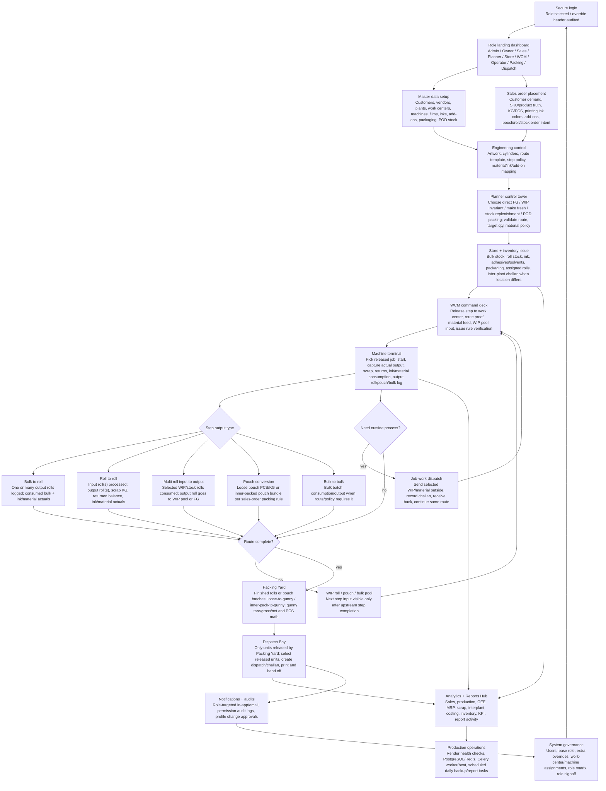

# Total Poly Print ERP - End-to-End System Flow

Use this chart to explain the live ERP to new users. It shows the normal path from secure login through commercial order, planning, shop-floor execution, packing, dispatch, reporting, and governance.

## Operational Rule Of Thumb

- Sales owns the customer promise: KG, PCS, product truth, print/ink requirement, pouch/roll/packing requirement.
- Engineering owns repeatable manufacture: artwork, cylinder, route, step policy, material and ink mapping.
- Planner owns release choice: direct FG, WIP/invariant, make fresh, jobwork continuation, replenishment, and target/remaining pressure.
- Store owns material truth: issue, receipt, inter-plant transfer, GRN, bulk inventory, roll inventory, ink/material stock.
- WCM owns step readiness: queue release, material feed policy, WIP input selection, machine assignment, current-step handoff.
- Operator/Machine terminal owns actuals: output logs, roll/pouch/bulk/batch truth, ink/material consumption, scrap, returns, close.
- Packing Yard owns physical dispatch units before dispatch: loose pouches, inner packs, gunnies, roll handoff, tare/gross/net/PCS.
- Dispatch Bay owns shipment handoff: only packing-released units appear; challan/dispatch/print/complete happens there.
- Reports/analytics read from live operational records; if a report has zeros, verify upstream execution actuals and issue/consumption logs first.
- Governance controls access with one base role plus explicit extra overrides; overrides should be rare and visible.
