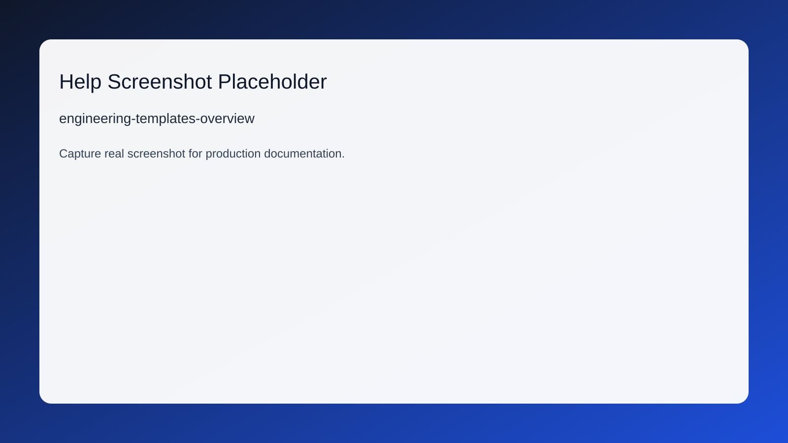

# Engineering • Templates

## Route
- /engineering/templates

## Module
- Engineering

## Roles
- ADMIN
- OWNER
- SUPER_ADMIN
- ENGINEERING

## Summary (EN)
Use this page to govern technical definitions, approvals, and production templates.

## Summary (HI)
इस पेज का उपयोग तकनीकी परिभाषाओं, अनुमोदनों और उत्पादन टेम्पलेट्स को संचालित करने के लिए करें।

## Purpose (EN)
This guide helps users complete all key tasks on Engineering • Templates without process ambiguity.

## Purpose (HI)
यह गाइड उपयोगकर्ताओं को Engineering • Templates पर सभी मुख्य कार्य बिना प्रक्रिया भ्रम के पूरा करने में मदद करती है।

## Prerequisites (EN)
- Confirm role access and location context before making changes.
- Validate upstream data (master/order/job) is already approved.

## Prerequisites (HI)
- परिवर्तन करने से पहले भूमिका एक्सेस और लोकेशन संदर्भ की पुष्टि करें।
- सुनिश्चित करें कि अपस्ट्रीम डेटा (मास्टर/ऑर्डर/जॉब) पहले से अनुमोदित है।

## Key Actions (EN)
- Review page KPIs or status cards to identify pending actions.
- Apply filters, open target record, and verify required fields.
- Submit action, confirm success toast, and re-check downstream impact.

## Key Actions (HI)
- लंबित कार्य पहचानने के लिए KPI या स्टेटस कार्ड की समीक्षा करें।
- फिल्टर लागू करें, लक्ष्य रिकॉर्ड खोलें, और आवश्यक फ़ील्ड सत्यापित करें।
- कार्रवाई सबमिट करें, सफलता संदेश की पुष्टि करें, और डाउनस्ट्रीम प्रभाव पुनः जांचें।

## Field Help
- **Primary Selector** (EN): Always choose the correct plant/work center/machine context first.
  - **प्राथमिक चयन** (HI): हमेशा पहले सही प्लांट/वर्क सेंटर/मशीन संदर्भ चुनें।
- **Status** (EN): Status transitions are controlled; only valid next states are allowed.
  - **स्थिति** (HI): स्थिति परिवर्तन नियंत्रित हैं; केवल वैध अगली स्थिति ही अनुमत है।
- **Audit Notes** (EN): Record reason codes and comments for every override decision.
  - **ऑडिट नोट्स** (HI): हर ओवरराइड निर्णय के लिए कारण कोड और टिप्पणियाँ दर्ज करें।

## Decision Flow
- engineering-approval-flow
1. Draft technical definition
   - Outcomes: Ready for review, Incomplete
2. Approve with signoff
   - Outcomes: Approved

## Common Errors
- **EN:** Permission denied / action hidden - Role matrix or governance visibility is missing for this module/action.
  - **HI:** अनुमति अस्वीकृत / कार्रवाई छिपी हुई - इस मॉड्यूल/कार्रवाई के लिए रोल मैट्रिक्स या गवर्नेंस दृश्यता सेट नहीं है।
- **EN:** Validation failed on submit - Mandatory fields are blank or context selection is inconsistent.
  - **HI:** सबमिट पर वैलिडेशन विफल - अनिवार्य फ़ील्ड खाली हैं या संदर्भ चयन असंगत है।

## Recovery Steps (EN)
- Refresh the page and re-open the target record from list view.
- Validate role override context, then retry with correct module permissions.
- If issue persists, raise Governance ticket with route, payload, and timestamp.

## Recovery Steps (HI)
- पेज रिफ्रेश करें और सूची दृश्य से लक्ष्य रिकॉर्ड फिर खोलें।
- रोल ओवरराइड संदर्भ सत्यापित करें, फिर सही अनुमति के साथ पुनः प्रयास करें।
- समस्या बनी रहे तो route, payload और timestamp सहित Governance टिकट उठाएँ।

## Related Routes
- /engineering/approvals
- /engineering/approvals/[id]
- /engineering/artworks

## Screenshot References
- 
- 

## FAQ References
- faq-access-control
- faq-data-refresh
