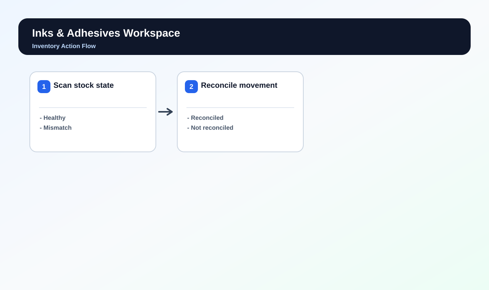

# Inks & Adhesives Workspace

## Route
- /inventory/addons-v36

## Module
- Inventory

## Roles
- ADMIN
- OWNER
- STORE
- PLANNER
- PLANT_MANAGER

## Summary (EN)
Inks & Adhesives Workspace groups color-bearing inks, adhesives, solvents, and purchased add-ons with inventory and master context.

## Summary (HI)
Inks & Adhesives Workspace groups color-bearing inks, adhesives, solvents, and purchased add-ons with inventory and master context.

## Purpose (EN)
Use it to inspect available stock and verify color/add-on masters before order, artwork, GRN, or packing selection.

## Purpose (HI)
Use it to inspect available stock and verify color/add-on masters before order, artwork, GRN, or packing selection.

## Prerequisites (EN)
- Confirm the correct plant, role, period, and source record before posting.
- Use the current V36 workspace route for new work; legacy routes only redirect into the current flow.
- Review visible validation errors before submit and keep source proof ready for audit.

## Prerequisites (HI)
- Confirm the correct plant, role, period, and source record before posting.
- Use the current V36 workspace route for new work; legacy routes only redirect into the current flow.
- Review visible validation errors before submit and keep source proof ready for audit.

## Key Actions (EN)
- Open the current workspace and check the summary, filters, and selected context.
- Pick records from searchable selectors instead of typing stale codes wherever the UI provides a picker.
- Submit, confirm the toast/result, then re-open the linked stock card, order, or audit trail.

## Key Actions (HI)
- Open the current workspace and check the summary, filters, and selected context.
- Pick records from searchable selectors instead of typing stale codes wherever the UI provides a picker.
- Submit, confirm the toast/result, then re-open the linked stock card, order, or audit trail.

## Field Help
- **Context** (EN): Plant, warehouse, stock class, route, and role decide which records and actions are valid.
  - **Context** (HI): Plant, warehouse, stock class, route, and role decide which records and actions are valid.
- **Quantity** (EN): Use the UOM shown by the selected material. Rolls use gross/tare/net where applicable; bulk and packaging use their master UOM.
  - **Quantity** (HI): Use the UOM shown by the selected material. Rolls use gross/tare/net where applicable; bulk and packaging use their master UOM.
- **Audit note** (EN): Write the reason when a transaction changes stock, closes a period, or corrects a posted record.
  - **Audit note** (HI): Write the reason when a transaction changes stock, closes a period, or corrects a posted record.

## Decision Flow
- inventory-action-flow
1. Scan stock state
   - Outcomes: Healthy, Mismatch
2. Reconcile movement
   - Outcomes: Reconciled, Not reconciled

## Common Errors
- **EN:** No selectable item - The selected filter, plant, or material class does not match active stock or master data.
  - **HI:** No selectable item - The selected filter, plant, or material class does not match active stock or master data.
- **EN:** Validation failed - A required source, quantity, location, UOM, or approval step is missing.
  - **HI:** Validation failed - A required source, quantity, location, UOM, or approval step is missing.
- **EN:** Action hidden - Role permissions, period status, or route state blocks the next step.
  - **HI:** Action hidden - Role permissions, period status, or route state blocks the next step.

## Recovery Steps (EN)
- Refresh the page and reselect plant, warehouse, and class filters.
- Use the inline help flow and field help to confirm the expected action.
- If still blocked, capture route, payload context, screenshot, and timestamp for admin review.

## Recovery Steps (HI)
- Refresh the page and reselect plant, warehouse, and class filters.
- Use the inline help flow and field help to confirm the expected action.
- If still blocked, capture route, payload context, screenshot, and timestamp for admin review.

## Related Routes
- /inventory
- /inventory/grn-v36
- /inventory/period
- /inventory/traceability-v36

## Screenshot References
- 
- 

## FAQ References
- faq-access-control
- faq-data-refresh
