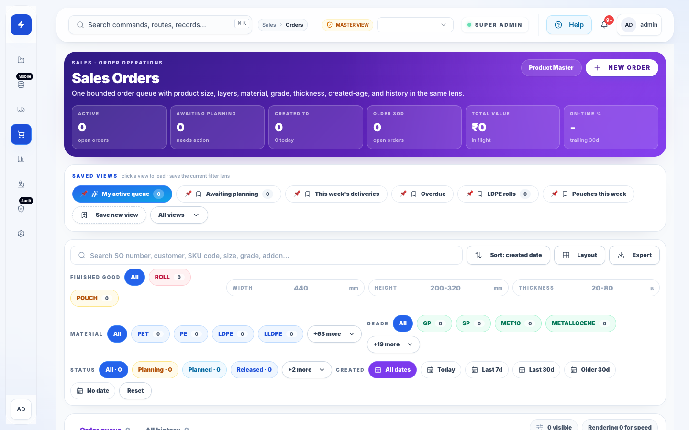
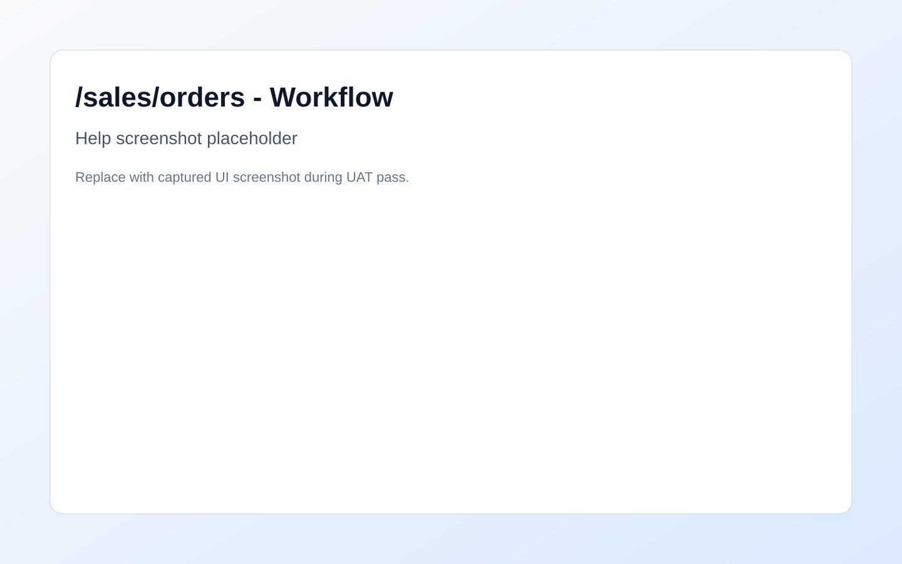

# New Sales Order Redirect

## Route
- /sales/orders/new

## Module
- Sales

## Roles
- ADMIN
- OWNER
- SALES

## Summary (EN)
Use this page to complete the current ERP workflow with validated data and clear downstream impact.

## Summary (HI)
Use this page to complete the current ERP workflow with validated data and clear downstream impact.

## Purpose (EN)
This guide keeps the workflow consistent, auditable, and easy to recover if a validation step fails.

## Purpose (HI)
This guide keeps the workflow consistent, auditable, and easy to recover if a validation step fails.

## Prerequisites (EN)
- Confirm role access and the correct plant or business context.
- Make sure upstream master data and approvals are complete before posting changes.

## Prerequisites (HI)
- Confirm role access and the correct plant or business context.
- Make sure upstream master data and approvals are complete before posting changes.

## Key Actions (EN)
- Review the live state, filters, and pending exceptions.
- Enter or select the required records, then validate totals before submit.
- Submit the action and re-check the linked stock, order, or audit trail.

## Key Actions (HI)
- Review the live state, filters, and pending exceptions.
- Enter or select the required records, then validate totals before submit.
- Submit the action and re-check the linked stock, order, or audit trail.

## Field Help
- **Primary context** (EN): Choose the plant, period, product, or work area before editing lines.
  - **Primary context** (HI): Choose the plant, period, product, or work area before editing lines.
- **Status** (EN): Only valid workflow states should be used for posting or approval.
  - **Status** (HI): Only valid workflow states should be used for posting or approval.
- **Notes** (EN): Capture the reason for overrides, corrections, or manual approvals.
  - **Notes** (HI): Capture the reason for overrides, corrections, or manual approvals.

## Decision Flow
- sales-order-flow
1. Create and validate order
   - Outcomes: Valid, Validation error
2. Release to planning
   - Outcomes: Released

## Common Errors
- **EN:** Validation failed - Required fields are blank or the selected context does not match the record.
  - **HI:** Validation failed - Required fields are blank or the selected context does not match the record.
- **EN:** Permission denied - The current role does not have access to this workflow action.
  - **HI:** Permission denied - The current role does not have access to this workflow action.

## Recovery Steps (EN)
- Refresh the page and re-open the record from the current workspace.
- Correct the missing context or field-level validation error.
- If the issue persists, raise a governance note with route, payload, and timestamp.

## Recovery Steps (HI)
- Refresh the page and re-open the record from the current workspace.
- Correct the missing context or field-level validation error.
- If the issue persists, raise a governance note with route, payload, and timestamp.

## Related Routes
- /inventory
- /production/planner
- /dashboard/planner

## Screenshot References
- 
- 

## FAQ References
- faq-access-control
- faq-data-refresh
