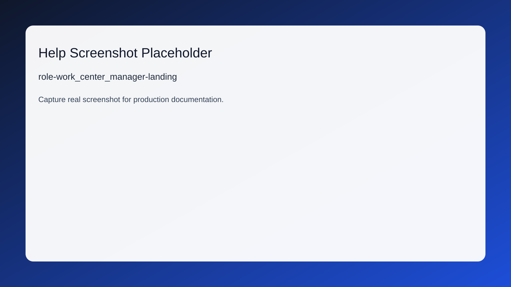

# Work Center Manager Guide

## Overview (EN)
Work Center Manager is responsible for secure, policy-compliant execution in assigned ERP modules.

## Overview (HI)
Work Center Manager की जिम्मेदारी है कि निर्धारित ERP मॉड्यूल में सुरक्षित और नीति-अनुपालन निष्पादन हो।

## Landing Page
- /production/work-center

## Responsibilities (EN)
- Execute role-specific actions only within assigned module boundaries.
- Maintain traceable updates with complete audit notes.
- Escalate blockers early using governance-approved escalation paths.

## Responsibilities (HI)
- केवल निर्धारित मॉड्यूल सीमाओं में भूमिका-विशिष्ट कार्य निष्पादित करें।
- पूर्ण ऑडिट नोट्स के साथ ट्रेस करने योग्य अपडेट बनाए रखें।
- गवर्नेंस-स्वीकृत एस्केलेशन मार्गों से बाधाओं को समय पर बढ़ाएँ।

## Daily Checklist (EN)
- Review landing dashboard alerts and open high-priority queues first.
- Complete pending approvals/tasks and verify downstream impact.
- Close day with unresolved exception review and handoff notes.

## Daily Checklist (HI)
- लैंडिंग डैशबोर्ड अलर्ट देखें और पहले उच्च-प्राथमिकता कतारें खोलें।
- लंबित अनुमोदन/कार्य पूरे करें और डाउनस्ट्रीम प्रभाव सत्यापित करें।
- दिन समाप्ति पर अनसुलझे अपवाद और हैंडऑफ नोट्स की समीक्षा करें।

## Core Workflows (EN)
- Start from /production/work-center, execute primary queue actions, and confirm status transitions.
- Use Help decision flow before forcing overrides or exception closures.

## Core Workflows (HI)
- /production/work-center से शुरू करें, प्राथमिक कतार कार्य निष्पादित करें, और स्थिति परिवर्तन पुष्टि करें।
- ओवरराइड या अपवाद क्लोज़ से पहले Help decision flow का उपयोग करें।

## Escalation Paths (EN)
- Access issue -> System Governance / Role Matrix owner.
- Data integrity issue -> Module owner + Admin on-call.

## Escalation Paths (HI)
- एक्सेस समस्या -> System Governance / Role Matrix मालिक।
- डेटा अखंडता समस्या -> मॉड्यूल मालिक + Admin on-call।

## FAQ
1. **Q (EN):** What should I do if an action is missing?
   - **A (EN):** Verify active role and governance visibility. Then check Role Matrix assignment.
   - **Q (HI):** यदि कोई कार्रवाई नहीं दिख रही हो तो क्या करें?
   - **A (HI):** सक्रिय भूमिका और गवर्नेंस दृश्यता जांचें। फिर Role Matrix असाइनमेंट सत्यापित करें।
2. **Q (EN):** When should I use override actions?
   - **A (EN):** Only with documented reason, approval context, and follow-up audit entry.
   - **Q (HI):** ओवरराइड कार्रवाई कब उपयोग करें?
   - **A (HI):** केवल दस्तावेज़ित कारण, अनुमोदन संदर्भ और फॉलो-अप ऑडिट एंट्री के साथ।

## Screenshot References
- 
